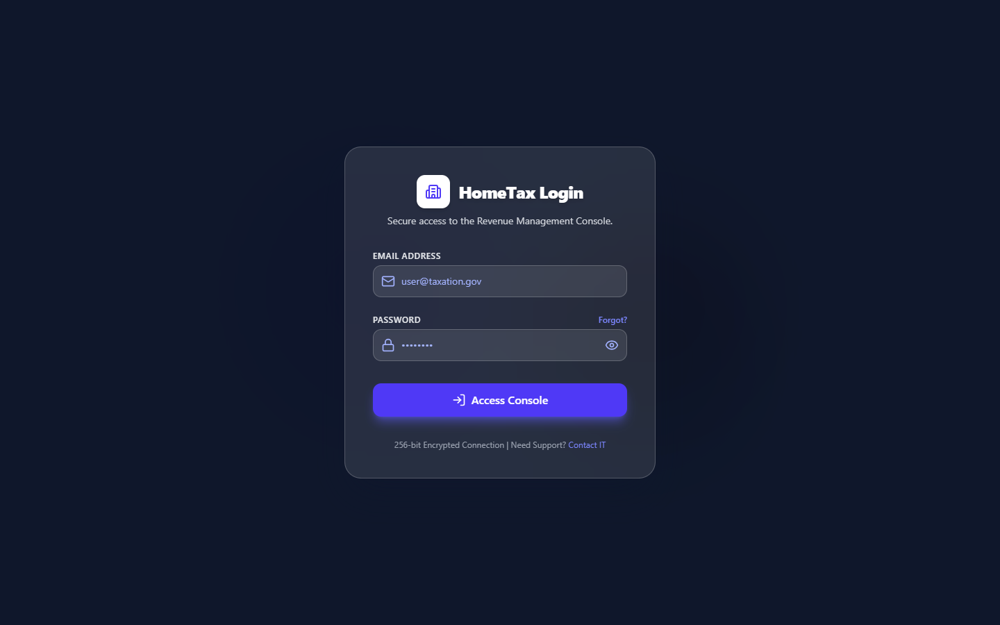
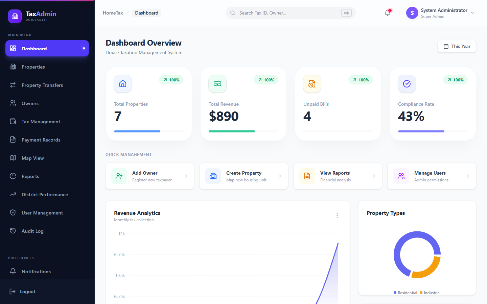
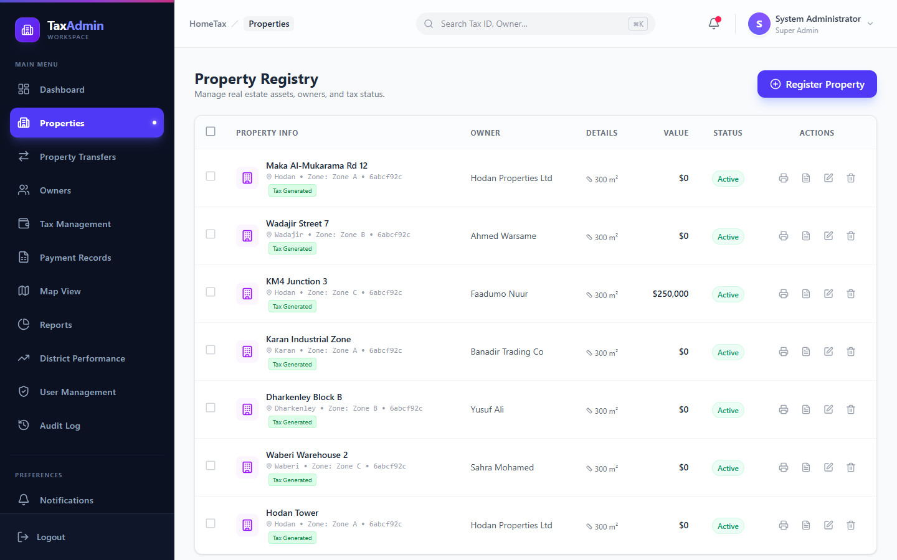
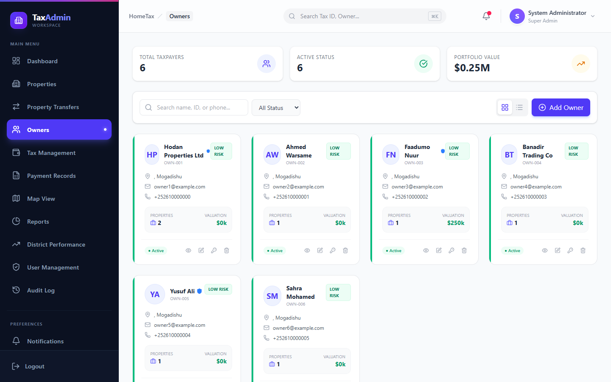
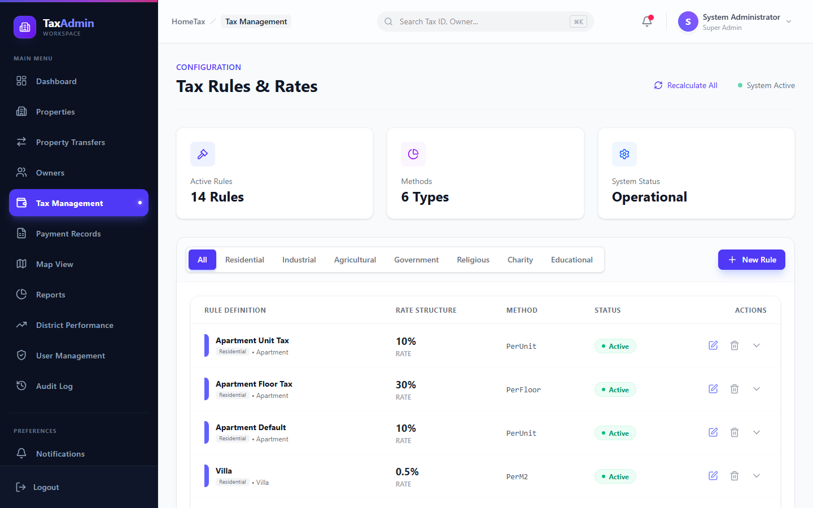
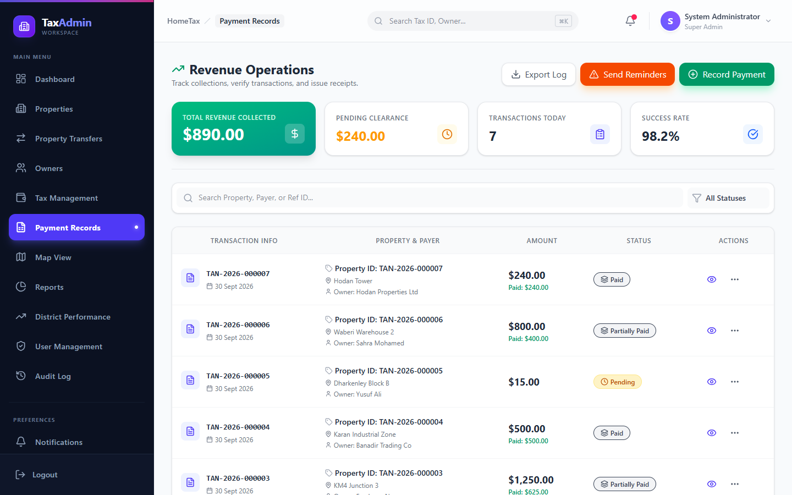
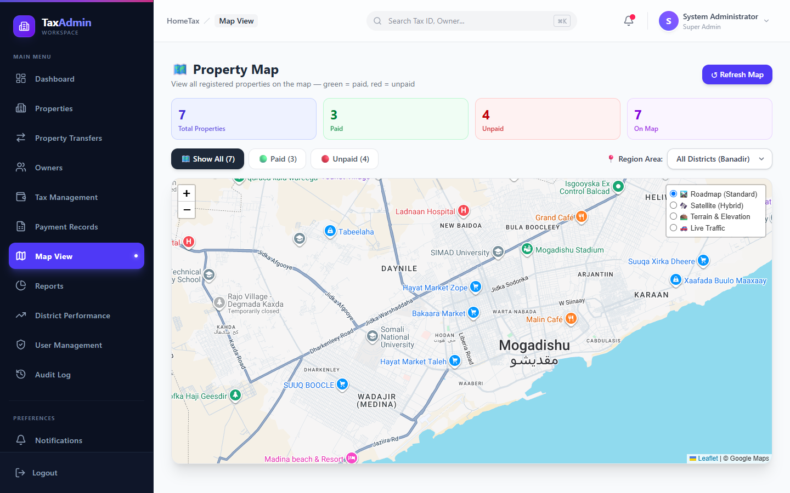
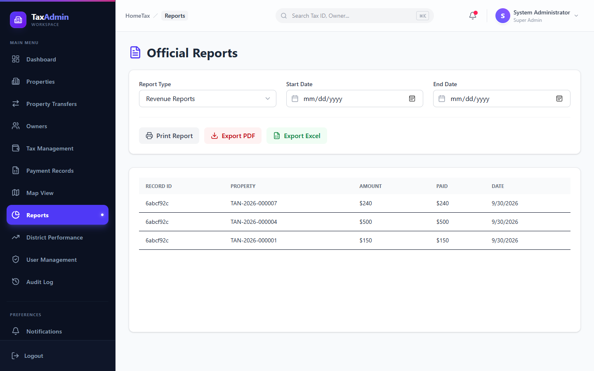
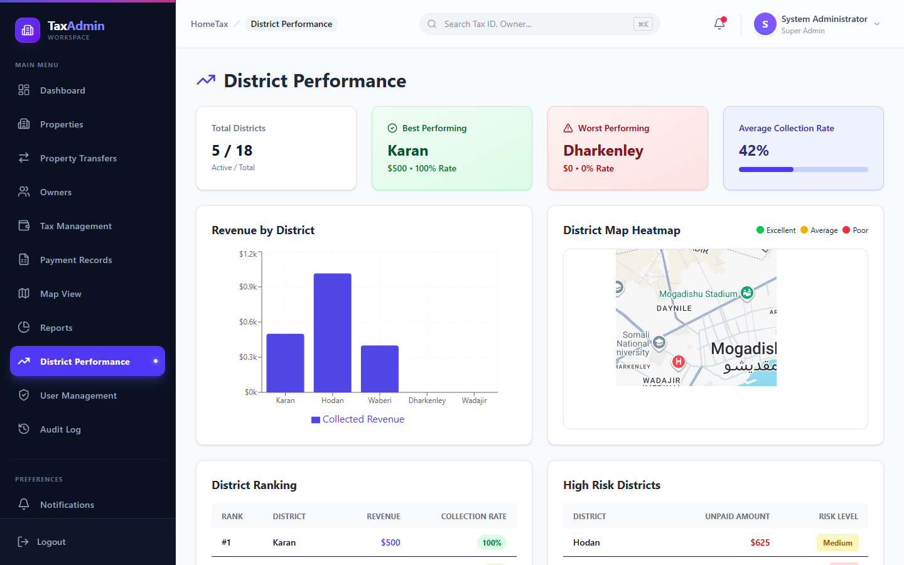

# House Taxation Management System (HTMS)

A full-stack web application for digitising municipal house-tax administration. HTMS centralises property and owner records, tax assessment, payment tracking, reporting, and administrative oversight in one secure platform.

## Features

- Property and owner registration, search, and management
- Tax rules, tax records, payment records, and outstanding-balance tracking
- Property-transfer management
- Dashboard analytics, district performance, and exportable reports
- Interactive property map
- Role-based access control with JWT authentication
- User profiles, system settings, audit logs, and in-app notifications
- Support tickets plus optional email and SMS notifications
- Responsive React interface for administrative workflows

## Screenshots

Screenshots were taken with sample demo data.

| Login | Dashboard |
| --- | --- |
|  |  |

| Properties | Owners |
| --- | --- |
|  |  |

| Tax Management | Payment Records |
| --- | --- |
|  |  |

| Map View | Reports |
| --- | --- |
|  |  |

| District Performance |
| --- |
|  |

## Technology

| Area | Tools |
| --- | --- |
| Frontend | React, Vite, React Router, Tailwind CSS, Axios, Recharts, Leaflet |
| Backend | Node.js, Express, Mongoose |
| Database | MongoDB / MongoDB Atlas |
| Security | JWT, bcryptjs, role-based authorisation |
| Reporting | jsPDF, jsPDF-AutoTable, XLSX |

## Project structure

```text
.
├── Frontend/                 # React and Vite client
│   └── src/
│       ├── pages/            # Dashboard, properties, taxes, reports, etc.
│       ├── components/
│       ├── context/
│       └── services/
├── Backend/                  # Express API
│   ├── src/
│   │   ├── controllers/
│   │   ├── models/
│   │   ├── routes/
│   │   ├── middleware/
│   │   └── services/
│   └── server.js
└── README.md
```

## Getting started

### Prerequisites

- Node.js 18 or later
- A MongoDB database (local MongoDB or MongoDB Atlas)

### 1. Configure the backend

```bash
cd Backend
npm install
```

Create `Backend/.env` and set the required values:

```env
PORT=5000
MONGODB_URI=mongodb://127.0.0.1:27017/house_taxation_db
JWT_SECRET=replace-with-a-long-random-secret
```

For MongoDB Atlas, you may alternatively set `MONGODB_URI_BASE` and `MONGODB_PASSWORD`. Email and SMS features require their respective provider credentials.

Start the API:

```bash
npm run dev
```

### 2. Configure and run the frontend

Open another terminal:

```bash
cd Frontend
npm install
```

Create `Frontend/.env`:

```env
VITE_API_URL=http://localhost:5000/api
```

Then start the client:

```bash
npm run dev
```

Open the local URL shown by Vite (usually `http://localhost:5173`).

## Available modules

- Dashboard and district performance
- Properties, owners, and property transfers
- Tax management and payment records
- Reports and map view
- Users, notifications, audit logs, profile, and settings
- Owner portal and support tickets

## Security

HTMS protects administrative routes with JWT-based authentication and role middleware. Keep all `.env` files private, use a strong `JWT_SECRET`, and never commit credentials to the repository.

## License

This project is licensed under the ISC License. See the backend package metadata for details.
